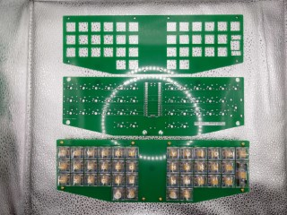
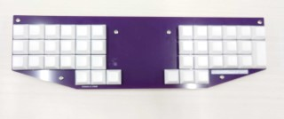

# madbd

最下段のキー数が少ないおおむね格子状のキーボード

## Images

### 0.0.1

### 0.0.2

## Show Links

- raspberry pi pico datasheet
  - <https://datasheets.raspberrypi.com/pico/pico-datasheet.pdf>
- raspberry pi pico KiCad files
  - <https://datasheets.raspberrypi.com/rp2040/VGA-KiCAD.zip>
- Automated wiring tool
  - <https://github.com/freerouting/freerouting>
